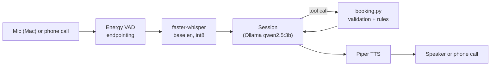

# Voice Booking Agent

A fully local, free voice AI agent that books appointments. You talk to it; it transcribes your speech, decides when to check availability or book, enforces business rules in code, and talks back. No cloud AI APIs.

**Status**
- ✅ **Text agent:** tool-calling LLM with code-enforced guardrails, unit-tested
- ✅ **Voice on a Mac:** mic → speech-to-text → agent → text-to-speech → speaker, all local
- ✅ **Phone server:** Twilio webhook + Media Streams WebSocket server (8 kHz μ-law), verified end to end with a protocol-accurate client through a public tunnel
- ⚠️ **Live phone calls:** Twilio reached the webhook and a real call played server-generated TwiML, but the trial number never opened the Media Stream (see [Debugging the phone integration](#debugging-the-phone-integration))

## Architecture



The agent (`agent.py`) is text in, text out. The Mac voice loop and the phone server are two thin audio layers around the same `Session`, so the agent logic is identical in both.

## Key design decisions

**Code owns facts; the LLM owns language.** Testing showed the local 3B model inventing facts: wrong dates for "Tuesday", availability it never checked, a booking confirmation for a booking that never happened, and a placeholder name (`"user"`). So responsibilities are split:

| Fact | Owned by |
|---|---|
| Which date "next Tuesday" or "the 15th" means | `dates.py`: deterministic resolver with a documented policy, unit-tested |
| What's available | Code checks availability whenever the caller mentions a date and passes the result to the LLM as a `FACT` |
| Whether a booking is allowed | `run_tool()` guardrails: date was checked, name appears in the caller's own words, caller said yes, at most one booking per turn |
| The confirmation sentence | Built from the tool result by a template, not generated by the LLM |
| The caller's phone number | Injected from caller ID; the LLM never handles it |

**Guardrails are tested in both directions.** My first booking-claim guardrail blocked a legitimate confirmation question ("Your appointment is confirmed for 11 a.m.… Is this correct?") and looped. The fix narrowed the pattern, gave the model an exact confirmation template, capped retries with a safe fallback, and added tests for text that must *not* be blocked.

**Tool results are shaped for speech.** The agent receives `"say": "10 a.m."` and a spaced confirmation code, so a small model doesn't have to convert formats.

**Bounded tool loop.** At most 3 LLM rounds per turn; every tool failure returns a structured error the model can recover from, never an exception.

**Idempotent booking.** The same caller booking the same slot again gets the original confirmation instead of "already taken", which matters when a caller repeats themselves or a request is retried.

## Measured latency (M1 MacBook Pro, 8 GB RAM)

| Stage | Measured |
|---|---|
| Speech-to-text (faster-whisper `base.en`, int8, CPU) | ~0.4–0.8 s |
| LLM per call (qwen2.5:3b, warm) | ~1–2.6 s |
| Text-to-speech, first audio (Piper, warm) | ~0.1–0.2 s |
| **Typical turn** (end of speech → first audio) | **~1.5–2.8 s**, plus 0.7 s silence detection |
| **Booking turn** | 6.5 s → **2.8 s** after replacing the second LLM call with a template |
| First turn | 6.9 s → ~2.6 s after warming up with the real prompt and tools |
The LLM is the bottleneck, so optimization focused there: fewer LLM calls per turn, a shorter prompt, and prompt-cache warm-up.

## Phone integration (Twilio Media Streams)

- `POST /voice` returns TwiML: `<Connect><Stream url="wss://…/media-stream">`
- `/media-stream` receives Twilio's JSON events (`start`, `media`, `mark`, `stop`)
- Audio: G.711 **μ-law at 8 kHz**, decoded/encoded in numpy (`audio.py`, unit-tested), resampled with an anti-aliasing polyphase filter (8 kHz → 16 kHz for Whisper; 22.05 kHz → 8 kHz for Piper)
- State machine: `listening → thinking → speaking`. Caller audio is ignored while thinking or speaking (half-duplex); a Twilio `mark` signals when playback actually finished
- Blocking model calls run via `asyncio.to_thread()` so the WebSocket event loop stays responsive
- Phone numbers are masked in logs (last 4 digits only)

### Debugging the phone integration

I verified each layer independently:

| Layer | Result | Evidence |
|---|---|---|
| Twilio → cloudflared tunnel → `POST /voice` | ✅ | A real call played server-generated `<Say>` TwiML |
| TwiML stream URL | ✅ | Logged the exact `wss://` URL returned to Twilio |
| Tunnel carries WebSockets from the public internet | ✅ | `scripts/ws_test.py` connected via the public URL |
| Handler speaks Twilio's protocol | ✅ | Simulated `connected`/`start` events → greeting synthesized, encoded, sent, mark returned |
| Twilio opens the Media Stream | ❌ | Twilio fetched `/voice` but never attempted the WebSocket connection |

Since the same URL accepted WebSockets from the public internet, the remaining blocker is on Twilio's side. The most likely cause is that Twilio's new-Console "product trial" numbers don't allow Media Streams. Upgrading the account, or a Twilio-compatible provider, should work without code changes.

## Run it

Requirements: macOS (Apple Silicon), [uv](https://docs.astral.sh/uv/), [Ollama](https://ollama.com/).

```bash
ollama pull qwen2.5:3b
uv sync
uv run python -m piper.download_voices en_US-lessac-medium --download-dir models/piper
```

The Whisper model downloads to `models/whisper` on first run.

**Text agent:** `uv run python agent.py`

**Voice on a Mac** (headphones recommended; use the built-in mic so Bluetooth headsets don't switch into low-quality call mode):
```bash
INPUT_DEVICE="MacBook Pro Microphone" uv run python voice_agent.py
```

**Phone server:**
```bash
uv run uvicorn main:app --port 8100
cloudflared tunnel --url http://localhost:8100
uv run python scripts/ws_test.py wss://YOUR-TUNNEL.trycloudflare.com/media-stream
```

**Tests:** `uv run pytest -v`

## Project structure

| File | Purpose |
|---|---|
| `booking.py` | Domain logic: open hours, rules, validation models, idempotent thread-safe booking |
| `dates.py` | Spoken date → calendar date |
| `agent.py` | Tool-calling `Session` with guardrails and speech-shaped tool results |
| `voice_agent.py` | Mac voice loop: persistent mic stream, energy VAD, Whisper, Piper |
| `phone.py` | Twilio webhook + Media Streams WebSocket handler |
| `audio.py` | G.711 μ-law codec |
| `main.py` | FastAPI app (HTTP tool endpoints + phone routes) |
| `test_*.py` | 24 unit tests: date resolution, guardrails (both directions), μ-law codec |
| `scripts/` | STT, TTS, and WebSocket test harnesses |

## Known limitations

- **Names:** Whisper `base.en` misrecognizes uncommon names, even spelled out (similar-sounding letters like T, D, and E get confused). On the phone, caller ID is used as the reliable identifier; names are best-effort and read back for confirmation.
- **In-memory bookings** reset on restart.
- **Half-duplex:** the caller can't interrupt the agent mid-sentence.
- **A 3B model** occasionally misreads lists or repeats itself; facts are protected by code, but conversation quality varies.
- **Twilio requests aren't signature-validated yet.**

## Future work

- **Barge-in:** keep listening while speaking, detect caller speech, send Twilio `clear` to stop playback
- **SQLite** with a unique `(date, time)` constraint replacing the in-memory dict and lock
- **Validate `X-Twilio-Signature`** on webhooks
- **Stream LLM tokens into TTS** sentence by sentence to cut perceived latency
- **Earliest-available search** done in code ("what's the soonest you have?")

## Licensing note

Piper (`piper-tts`) is GPL-3.0. Check dependency licenses before reusing this code in a closed-source product.